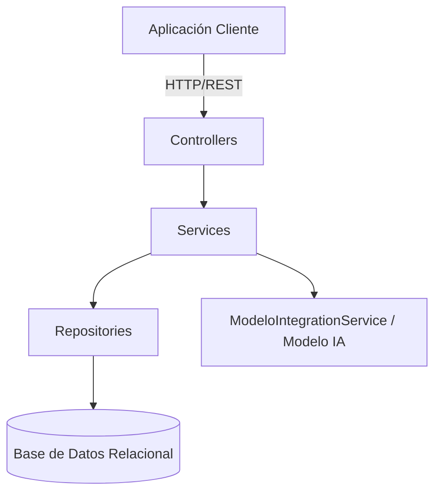
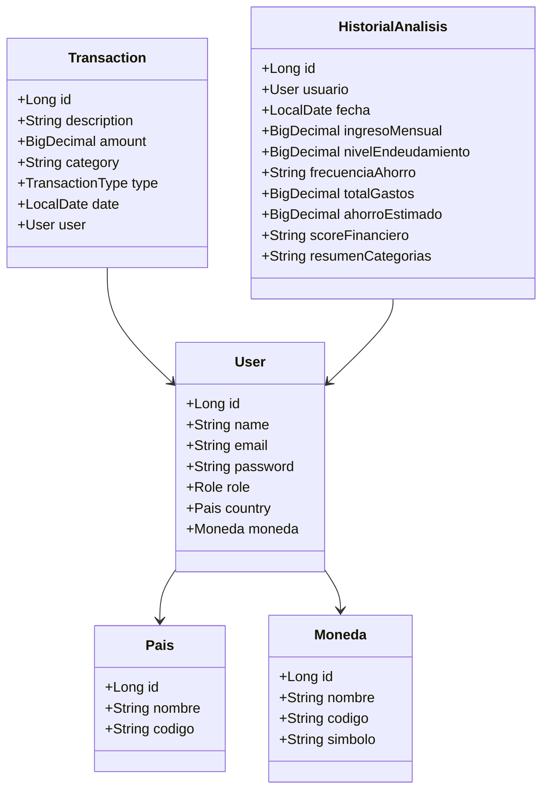

# Documentación del Backend - FinanceAI

## 1. Diagrama de Arquitectura

## 2. Diagrama de Clases

## 3. Diccionario de Datos
**paises**
- `id` (BIGINT, PK)
- `nombre` (VARCHAR, NOT NULL)
- `codigo` (VARCHAR, NOT NULL)

**monedas**
- `id` (BIGINT, PK)
- `nombre` (VARCHAR, NOT NULL)
- `codigo` (VARCHAR, NOT NULL)
- `simbolo` (VARCHAR, NOT NULL)

**usuarios**
- `id` (BIGINT, PK)
- `name` (VARCHAR, NOT NULL)
- `email` (VARCHAR, NOT NULL, UNIQUE)
- `password` (VARCHAR, NOT NULL)
- `pais_id` (BIGINT, FK)
- `moneda_id` (BIGINT, FK)
- `role` (VARCHAR, NOT NULL)

**transacciones**
- `id` (BIGINT, PK)
- `description` (VARCHAR, NOT NULL)
- `amount` (DECIMAL(15,2), NOT NULL)
- `category` (VARCHAR, NOT NULL)
- `type` (VARCHAR, NOT NULL)
- `date` (DATE, NOT NULL)
- `usuario_id` (BIGINT, NOT NULL, FK)

**historial_analisis**
- `id` (BIGINT, PK)
- `usuario_id` (BIGINT, NOT NULL, FK)
- `fecha` (DATE, NOT NULL)
- `ingreso_mensual` (DECIMAL(15, 2))
- `nivel_endeudamiento` (DECIMAL(15, 2))
- `frecuencia_ahorro` (VARCHAR(255))
- `total_gastos` (DECIMAL(15, 2))
- `ahorro_estimado` (DECIMAL(15, 2))
- `score_financiero` (VARCHAR(255))
- `resumen_categorias` (TEXT)

## 4. Matriz de Endpoints

| Controlador | Método | Endpoint | Payload de Petición | Payload de Respuesta |
|---|---|---|---|---|
| **AnalisisController** | POST | `/api/v1/analisis-financiero` | `Map<String, Object>` | `Map<String, Object>` O resultado completo de IA |
| | POST | `/api/v1/analisis-financiero/retrain` | - | `Map<String, String>` |
| | POST | `/api/v1/analisis-financiero/ia` | `Map<String, Object>` | `Map<String, Object>` (Resultado de IA) |
| | POST | `/api/v1/analisis-financiero/clasificar` | `Map<String, Object>` (descripcion, valor) | `Map<String, String>` (categoria, descripcion) |
| **AuthController** | POST | `/api/v1/auth/register` | `RegistroRequest` | `RegistroResponse` |
| | POST | `/api/v1/auth/login` | `LoginRequest` | `LoginResponse` |
| **DashboardController**| GET | `/api/v1/dashboard/summary` | - | `DashboardResponse` |
| | GET | `/api/v1/dashboard/history` | - | `List<DashboardResponse>` |
| **HealthController** | GET | `/api/v1/health` | - | `HealthResponse` |
| **TransactionController** | POST | `/api/v1/transactions` | `TransactionRequest` | `TransactionResponse` |
| | GET | `/api/v1/transactions` | - | `List<TransactionResponse>` |
| **UserController** | GET | `/api/v1/users/profile` | - | `UserResponse` |
| | PUT | `/api/v1/users/profile` | `UserUpdateRequest` | `UserResponse` |
