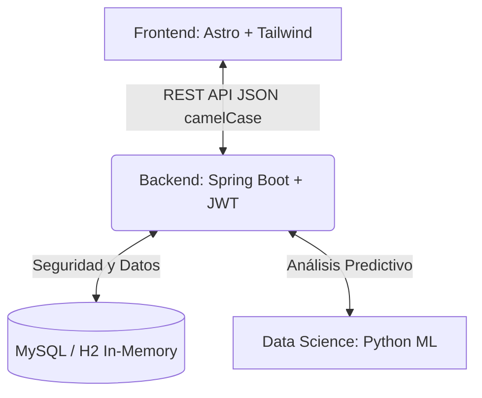

<div align="center">

# 🚀 FinanceAI - Análisis Financiero Inteligente

[](https://astro.build/)
[](https://spring.io/)
[](https://www.python.org/)
[](https://www.mysql.com/)

*Una plataforma financiera impulsada por IA que te ayuda a tomar el control de tu economía mediante predicciones y categorización inteligente.*

</div>

---

## 🎯 Sobre el Proyecto (MVP)
FinanceAI es una solución tecnológica desarrollada durante el Hackathon (Team-77) que permite a los usuarios registrar sus transacciones, obtener un perfil financiero y recibir recomendaciones personalizadas generadas por modelos de **Machine Learning**.

### ✨ Características Principales
- **Dashboard Interactivo:** Visualización clara de los patrones de gasto y métricas clave.
- **Predicción de IA Sensible a Moneda:** El modelo en Python analiza y proyecta tu salud financiera adaptándose a la moneda que elijas.
- **Arquitectura de Microservicios:** Módulos separados, robustos y fácilmente escalables (Frontend, Backend, y API de Datos).
- **Despliegue OCI (Oracle Cloud Infrastructure):** Diseñado para ser contenido en Docker y ejecutado eficientemente en la nube.

---

## 🏗️ Arquitectura de la Solución

El proyecto está dividido en tres módulos principales con responsabilidad única:



| Módulo | Directorio | Descripción |
| :--- | :--- | :--- |
| **Frontend** | `/Frontend` | Interfaz gráfica y UX. Autenticación, visualización y captura de datos (Astro). |
| **Backend** | `/Backend` | Lógica de negocio, autenticación, protección de endpoints y base de datos (Java). |
| **Data Science**| `/DataScient` | Entorno de ejecución de modelos `.joblib` y *scripts* para generar el *score* financiero. |

---

## 🚀 Guía de Inicio Rápido (Desarrollo Local)

Para orquestar todo el ecosistema de manera inmediata, hemos provisto un *script* automatizado. 

### 1. Requisitos Previos
- Node.js (v18+) y `pnpm`
- Java OpenJDK 17
- Python 3.10+
- Variables de entorno configuradas en el archivo `.env` en la raíz.

### 2. Ejecutar la Orquestación
Usa el inicializador unificado que preparará las bases de datos y lanzará los 3 servicios simultáneamente. Simplemente ejecuta en la terminal o da doble clic en:

```bash
./scripts/iniciar_proyecto.bat
```

> [!TIP]
> **Rutas expuestas:**
> - 🌐 **App Frontend:** `http://localhost:4321`
> - ⚙️ **API Backend:** `http://localhost:8080/api/v1`
> - 📊 **Documentación API:** `http://localhost:8080/swagger-ui.html`

---

## 📄 Licencia y Equipo
Construido con dedicación por el **G9-LATAM-Team-77**.
*Fernando (Frontend) · Justin (Backend) · Jonathan (DevOps/DS)*
